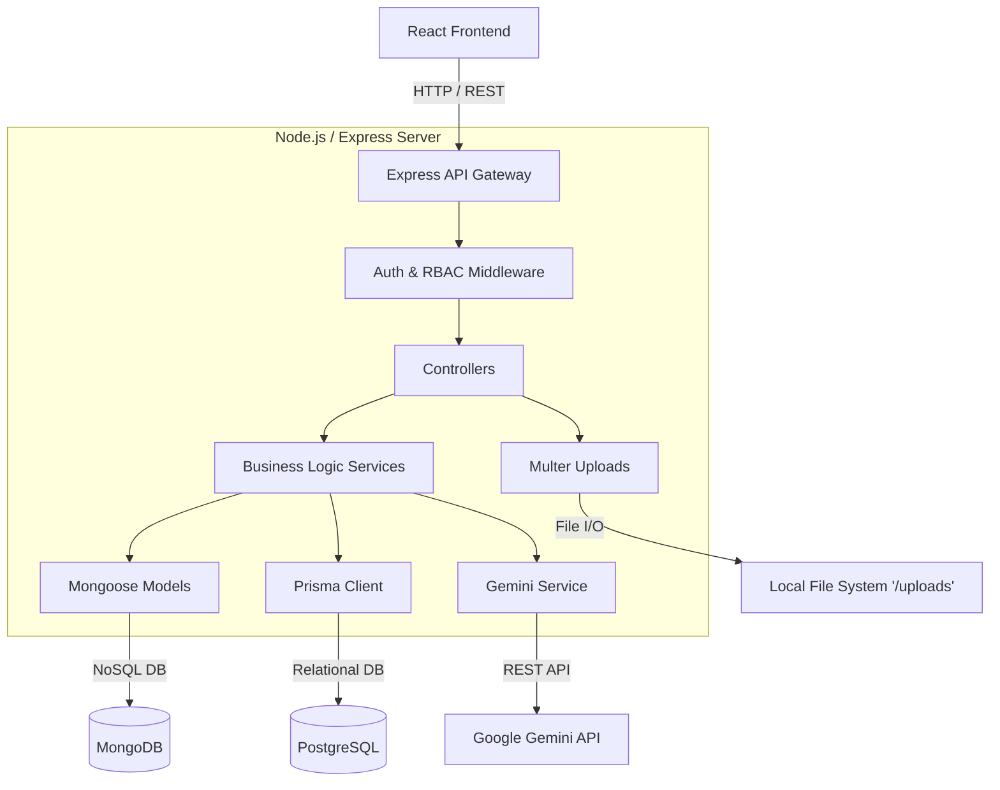

# AI-CreatorHub - High-Level Design (HLD)

## 1. System Overview
AI-CreatorHub is a monolithic full-stack web application implementing a hybrid database architecture. The system consists of a React/TypeScript frontend, a Node.js/Express backend, MongoDB for unstructured document storage, PostgreSQL for transactional relational data, and integration with the external Google Gemini LLM API.

## 2. Architecture Diagram

## 3. Major Components
- **React Frontend**: Client-side application built with React, Vite, and Tailwind CSS.
- **Express API**: The core backend web server built on Node.js and Express.
- **MongoDB / Mongoose**: Primary document database for Users, Content, Media metadata, and AI Requests.
- **PostgreSQL / Prisma**: Secondary relational database dedicated strictly to the Billing and Subscriptions domain.
- **Gemini API**: External Large Language Model utilized for text generation and intelligent assistant features.
- **File Storage**: Local filesystem-based storage (`/uploads`) handled via Multer for media uploads.

## 4. Frontend Architecture
The frontend follows a component-based architecture using React Context for state management (`AuthContext`). Routing is handled by React Router, with views separated into distinct Page components (`DashboardPage`, `ContentFormPage`, `AIAssistantPage`, etc.) and reusable UI components (`Navbar`, `Sidebar`). API communication is encapsulated within a centralized `api.ts` service layer using Axios.

## 5. Backend Architecture
The backend follows a classic layered MVC-style architecture modified for API-only responses:
- **Routes Layer**: Maps HTTP methods and endpoints to specific controller methods.
- **Middleware Layer**: Handles cross-cutting concerns (authentication, rate limiting, error handling).
- **Controller Layer**: Handles HTTP request parsing, Zod validation, and HTTP response formatting.
- **Service Layer**: Contains the core business logic (e.g., `billingService`, `geminiService`).
- **Data Access Layer**: Mongoose schemas and Prisma Client for database interactions.

## 6. Authentication Flow
1. Client submits email/password to `/api/auth/login`.
2. `authController` queries MongoDB.
3. `bcrypt` compares the hashed password.
4. If successful, `jsonwebtoken` signs a JWT containing the user's ID and role.
5. Client stores the JWT and attaches it as a Bearer token in the Authorization header for subsequent requests.
6. `authMiddleware` verifies the token on protected routes.

## 7. Authorization/RBAC Flow
1. The `authorize` middleware accepts an array of permitted roles (e.g., `['ADMIN']`).
2. After JWT verification, the middleware checks `req.user.role`.
3. If the user's role is not in the permitted list, a 403 Forbidden is returned.

## 8. Content Management Flow
1. Client POSTs to `/api/content`.
2. `contentValidator` (Zod) validates title, body, and status.
3. `contentController` invokes the Mongoose model to save the content.
4. The MongoDB `Content` collection stores the document, linked via `userId` to the author.

## 9. AI Generation Flow
1. Client POSTs prompt to `/api/ai/generate`.
2. `aiController` passes the prompt to `promptDefense` utility.
3. If sanitized, it calls `geminiService.generateContent()`.
4. The external Gemini API processes the request.
5. The response is saved to MongoDB (`AIRequest`) for auditing.
6. The generated text is returned to the client.

## 10. AI Function Calling Flow
1. Client chats with the AI Assistant (`/api/ai/chat`).
2. `geminiService` provides the Gemini API with a strict schema of available tools defined in `geminiTools.ts`.
3. Gemini LLM determines if a tool is needed and returns a `functionCall` response.
4. The backend executes the corresponding local function (e.g., fetching platform stats).
5. The backend returns the function result to Gemini to construct the final conversational response.

## 11. Prompt Injection Defense Flow
1. User submits an AI prompt.
2. The `promptDefense` module evaluates the string against known malicious regex patterns (e.g., "ignore previous instructions").
3. If a match is found, an error is thrown immediately, bypassing the LLM entirely and returning a 400 Bad Request to the user.

## 12. Media Upload Flow
1. Client uploads a multipart/form-data request to `/api/media/upload`.
2. The `multer` middleware streams the file to the local `/uploads` directory.
3. `mediaController` saves the file metadata (filename, original name, path) to MongoDB via the `Media` model.
4. The frontend accesses the image via the statically served `/uploads` route.

## 13. Billing/Subscription Flow
1. Client POSTs to `/api/billing/subscribe` with a `planId`.
2. `billingController` validates the input and calls `billingService`.
3. `billingService` initiates a Prisma `$transaction`.
4. The transaction atomically:
   - Upserts the user record into PostgreSQL.
   - Creates a new `Subscription` record.
   - Creates a new `Payment` record.
5. If any step fails, the entire transaction rolls back to preserve data integrity.

## 14. Database Architecture
**MongoDB**:
- `users`: Core identity, roles, hashed passwords.
- `contents`: Articles, blog posts.
- `media`: Image metadata.
- `airequests`: Audit logs of LLM usage.

**PostgreSQL**:
- `Plan`: Subscription tiers.
- `PlanFeature`: Normalized features for plans (1:N).
- `Subscription`: User subscriptions (N:1 to Plan).
- `Payment`: Financial records (N:1 to Subscription).
- `User`: Lazy-synced identity stub to maintain relational integrity.

## 15. API Layer
RESTful implementation utilizing Express routers mounted to `/api/*`.

## 16. Middleware Layer
- **Helmet**: Secures HTTP headers.
- **CORS**: Handles Cross-Origin Resource Sharing.
- **Rate Limiter**: Maps IPs to request counts to prevent abuse.
- **Global Error Handler**: Catches all synchronous/asynchronous errors and formats them into a standard JSON structure.

## 17. Security Architecture
- **Data at Rest**: Passwords hashed with bcrypt.
- **Data in Transit**: HTTPS (assumed in production).
- **Access Control**: JWT and RBAC.
- **Input Security**: Zod validation, Prompt Injection Defense.

## 18. Testing Architecture
- **Framework**: Vitest.
- **Request Simulation**: Supertest.
- **Database Mocking**: `mongodb-memory-server` for volatile NoSQL testing.
- **Integration DB**: Dedicated local PostgreSQL instance configured via `DATABASE_URL_TEST` for true Prisma integration testing.

## 19. Deployment/Environment Architecture
- Standard Node.js environment variables (`.env`).
- Local execution via `npm run dev` (utilizing `tsx` for backend and `vite` for frontend).
- Prisma migrations and local development databases orchestrated via `prisma dev`.
